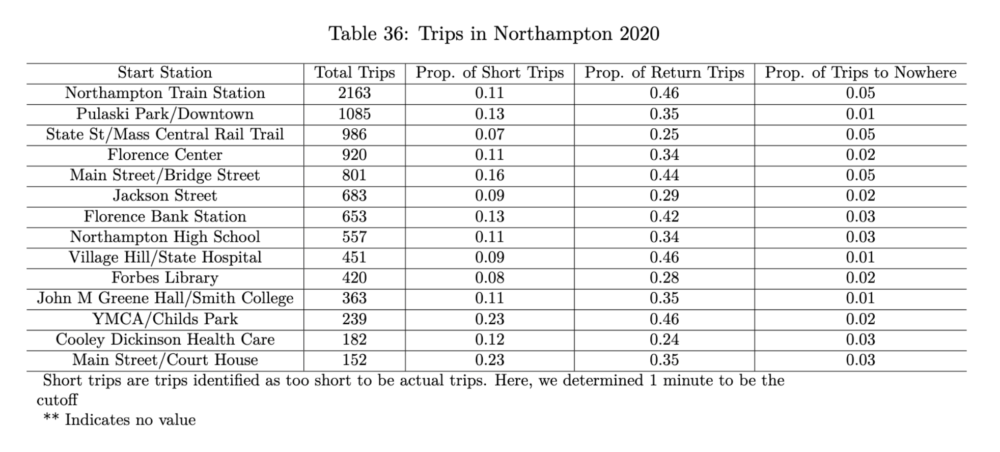
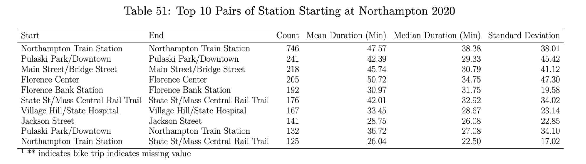
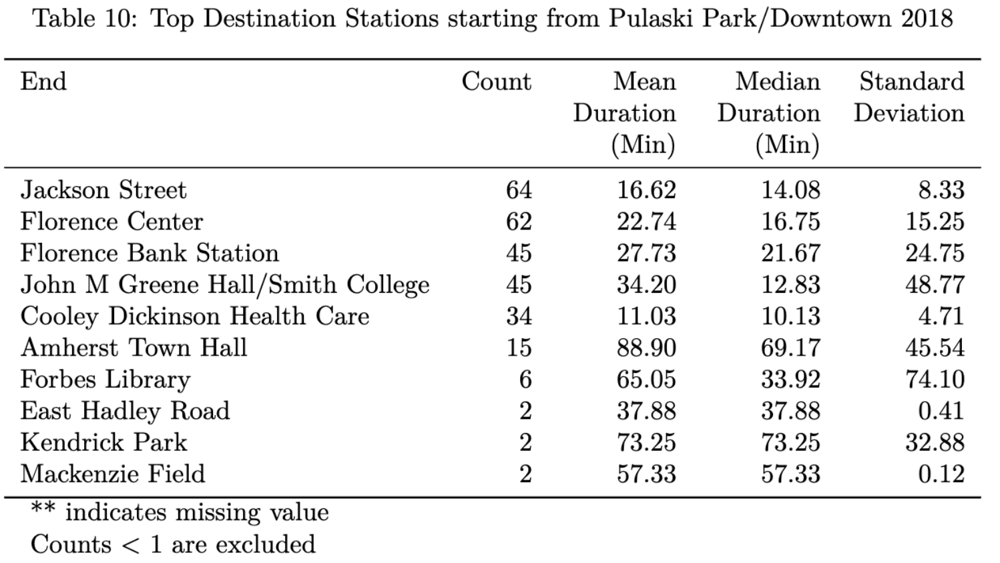
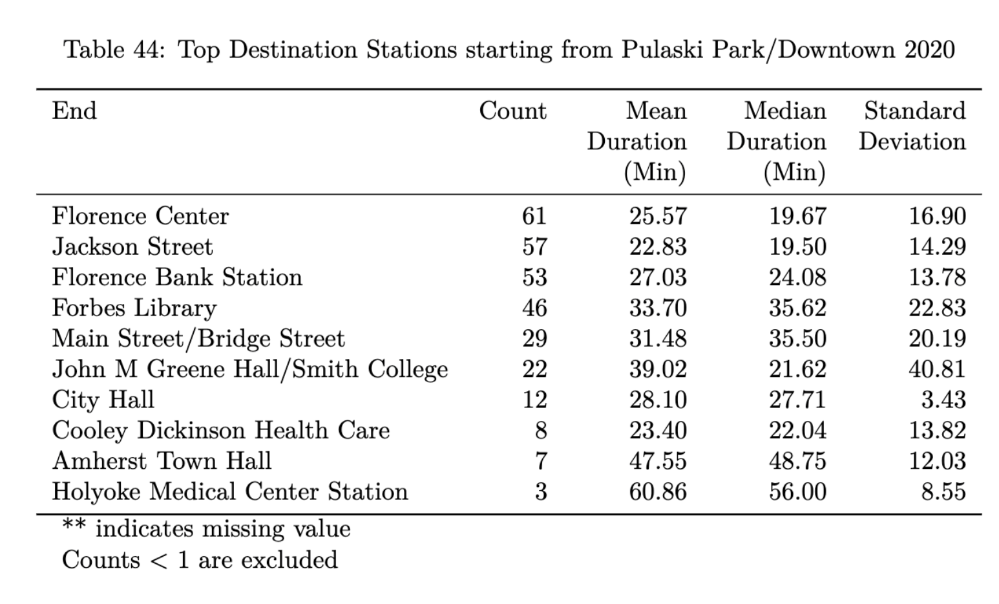

---
output:
  pdf_document: default
  html_document: default
---
# Station Summaries

```{r setup, include=FALSE}
library(tidyverse)   
library(mdsr)   
library(valleybikeData) 
library(kableExtra)
knitr::opts_chunk$set(
  tidy=TRUE,     # display code as typed
  echo = FALSE,
  message = FALSE)   
options(knitr.kable.NA = "**")
```

Before we try to look at where the bikes are going, we can look at where they start and end. Since the bikes are allowed to be docked at any station (and not just from where they started), there is a lot of value in seeing the relationship in start and ending stations.

We created a function that automatically generates reports that calculates several summary statistics such as when stations came online and went offline, proportion of short trips (less than one minute), average ride time between stations and counting rides between pairs of stations.

This first table shows the overall most used stations in Northampton in 2020.




This next table shows the overall most popular pairs of start/end stations in Northampton in 2020. This is also a useful reference to keep in mind where the most active areas are, and is interesting to see that the common pairs are not people just taking a loop around. They might be using it as means from one place to another.



Here we have two tables describing the top destination stations for Pulaski Park in 2018 vs 2020. For the most part, we can see that the top 3 destination stations stayed the same, but we should note when the stations become active each year was different so a direct comparison cannot be made. 





Using our function, we created many tables like this one for all the communities in the valley which can be used for comparison for year to year. 

